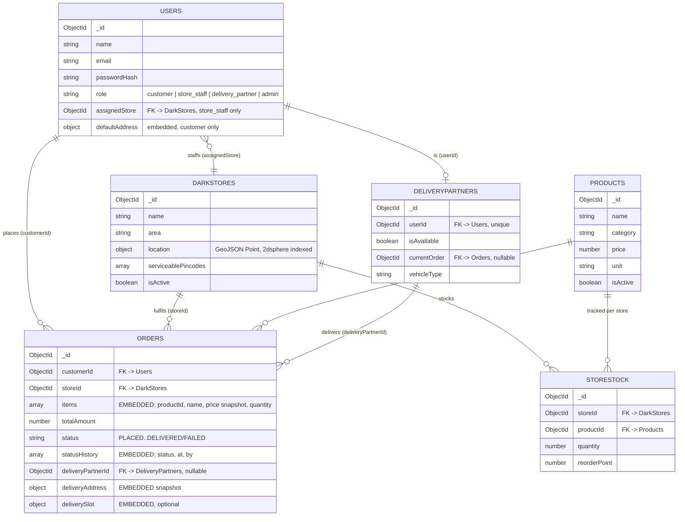

# ER / Collection Diagram

## Reference vs. Embedding rationale

| Data | Decision | Why |
|---|---|---|
| `Order.items[]` | **Embedded** | Always read together with the order; immutable after placement (price is a snapshot); never queried independently of its parent order. |
| `Order.statusHistory[]` | **Embedded** | Small, append-only, always read with the order, and is the direct input to the performance-report aggregation (module 12) — no separate `orderEvents` collection needed. |
| `Order.deliveryAddress` / `deliverySlot` | **Embedded** | Must freeze the delivery address at order time even if the customer edits their profile later. |
| `Order.customerId`, `Order.storeId`, `Order.deliveryPartnerId` | **Referenced** | Large, shared, independently-updated entities (a store or partner is not "owned" by one order). |
| `StoreStock.storeId` / `productId` | **Referenced** | `storeStock` is a many-to-many join table by nature — a product exists across many stores, and quantity is updated on almost every order, independently of both the store and product documents. |
| `User.assignedStore` | **Referenced** | A dark store is a shared entity independently managed by admins; embedding it would duplicate and desynchronize store data across every staff user. |
| `User.defaultAddress` | **Embedded** | Small, 1:1 with the user, no independent lifecycle. |
